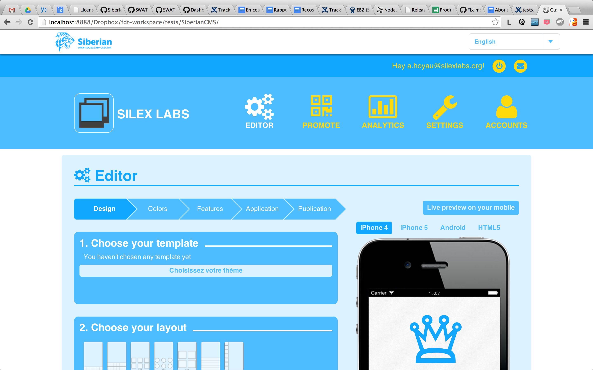

#SiberianCMS

## Install

Clone this repository or [download SiberianCMS](http://www.siberiancms.com/download/) and extract into a web accessible folder - be aware of [the requirements](http://www.siberiancms.com/download/).

You will need a MySQL server, so prepare your connexion details and an emty database.

Open a web browser and display the root folder and follow the instructions.

##License

Siberian is released under the [OSL License](http://www.siberiancms.com/license/)
